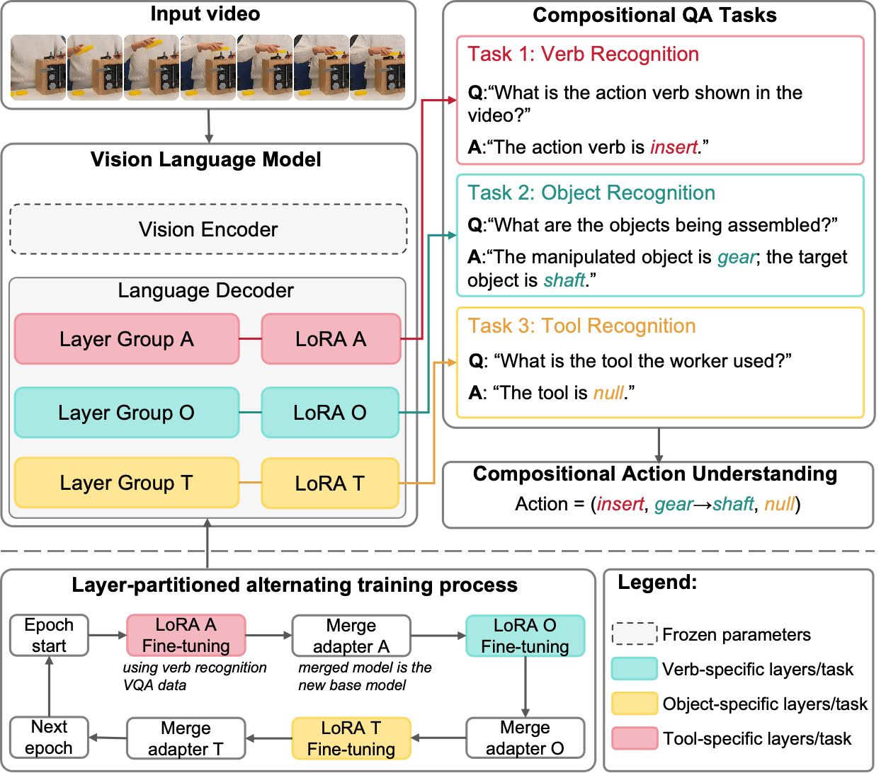

# Compositional Context Fine-tuning Vision-Language Model for Complex Assembly Action Understanding from Videos
This repository hosts the code for the work 'Compositional Context Fine-tuning Vision-Language Model for Complex Assembly Action Understanding from Videos'.

<p align="center">
  
  <br>
  <em>Figure 1: The Overall Framework of Compositional Context Fine-Tuning with Layer-Partitioned Alternating Training.</em>
</p>


This project implements fine-tuning of the [Qwen2.5-VL](https://github.com/QwenLM/Qwen-VL) vision-language model using the [LLaMA Factory](https://github.com/hiyouga/LLaMA-Factory) framework. The implementation involves cloning both repositories and applying custom modifications to enable CCFT fine-tuning.

## Project Structure
```bash
.
├── LLaMA-Factory/          # Core framework with custom training scripts
│   ├── configs/            # Configuration files
│   ├── data/               # Custom dataset
│   ├── saves/              # The folder to store LoRA adapter checkpoints
│   ├── models/             # The folder to store the merged models (base + adapters), ready for inference 
│   └── ... 
│
├── Qwen2.5-VL/             # Base model implementation
│   ├── eval_results/       # The folder to store evaluation results
│   ├── eval_*.py   # The scripts to evaluate fine-tuned models (from 'LLaMA-Factory/models/') on the testing dataset
│   └── ...                 
│
├── scripts/        
│   ├── train_eval_havid.sh  # The script to fine-tune models on HA-ViD-VQA datasets and evaluate the fine-tuned model.
│   ├── train_eval_ikea.sh  # The script to fine-tune models on IKEA-ASM-VQA dataset and evaluate the fine-tuned model.
│   
└── README.md               # Project documentation 
```
## Environment Preparation
Due to dependency conflicts between the LLaMA Factory framework and Qwen2.5-VL requirements, this project requires **two separate Conda environments**.

### LLaMA-Factory environment
```bash
cd LLaMA-Factory
conda create --name llama-qw python=3.10 -y
conda activate llama-qw
pip install -e ".[torch,metrics]"
```

### Qwen2.5-VL environment
```bash
cd Qwen2.5-VL
conda create --name Qwen25VL python=3.10 -y
conda activate Qwen25VL
git lfs install
git clone https://huggingface.co/Qwen/Qwen2.5-VL-7B-Instruct
pip install git+https://github.com/huggingface/transformers@f3f6c86582611976e72be054675e2bf0abb5f775
pip install accelerate
pip install qwen-vl-utils
pip install 'vllm>0.7.2'
```

## Data Preparation
The dataset is available at [Google Drive](https://drive.google.com/drive/folders/1diByN1t8jltN1YfTXXpW-hNvWrULWAEz?usp=sharing).
The structure of the Google Drive is: 
```bash
.
├── HA-ViD-VQA.zip          # HA-ViD-VQA videos
├── IKEA-ASM-VQA.zip        # IKEA-ASM-VQA videos
└── json_files.zip          #json files
```
Download and unzip all the files, then move them to the folder ```./LLaMA-Factory/data```

## Fine-tuning and Evaluation
We provide an end-to-end fine-tuning and evaluation script. The fine-tuned models will be stored in '/LLaMA-Factory/models' and the evaluation results will be stored in '/Qwen2.5-VL/eval_results'.

For HA-ViD-VQA, run ``` sh ./scripts/train_eval_havid.sh --task {lh_v0, lh_v1, lh_v2, rh_v0, rh_v1, rh_v2}``` where lh/rh indicate left-hand/right-hand actions and v0/v1/v2 correspond to side-view/front-view/top-view perspectives.

For IKEA-VQA, run ```sh ./scripts/train_eval_ikea.sh ```.

## Acknowledgments

This project stands on the shoulders of two significant open-source projects:
| Project | Contribution | License |
|---------|-------------|---------|
| **[LLaMA Factory](https://github.com/hiyouga/LLaMA-Factory)** | Fine-tuning framework<br>LoRA implementation<br>Training pipeline | Apache 2.0 |
| **[Qwen2.5-VL](https://github.com/QwenLM/Qwen-VL)** | Vision-language model<br>Multimodal architecture<br>Pretrained weights | Apache 2.0 |

We acknowledge the invaluable contributions of both teams to the open-source AI community.

## Citation
TBD
